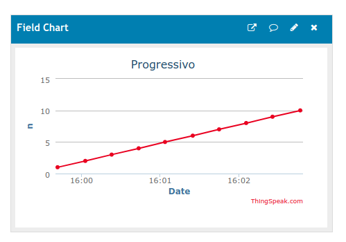

This simple sketch has been created to show a minimal example of *feed* operation from a constrained device (a WEMOS D1 mini) to the REST API of the ThingSpeak server.

Its function is to feed a channel with an increasing integer. The graph on channel web page should be similar to the following:

To operate the example, 

1.  create a new ThingSpeak channel (or re-cycle one), 

1. rename the **secret_template.h** to **secret.h**, 

1. open the directory in the Arduino IDE, and 

1. update the secret.h file with your data (WiFi credentials and channel API and Id)

Finally flash the sketch on the device using the Arduino IDE.